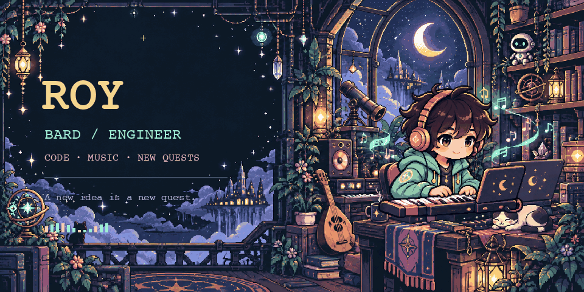
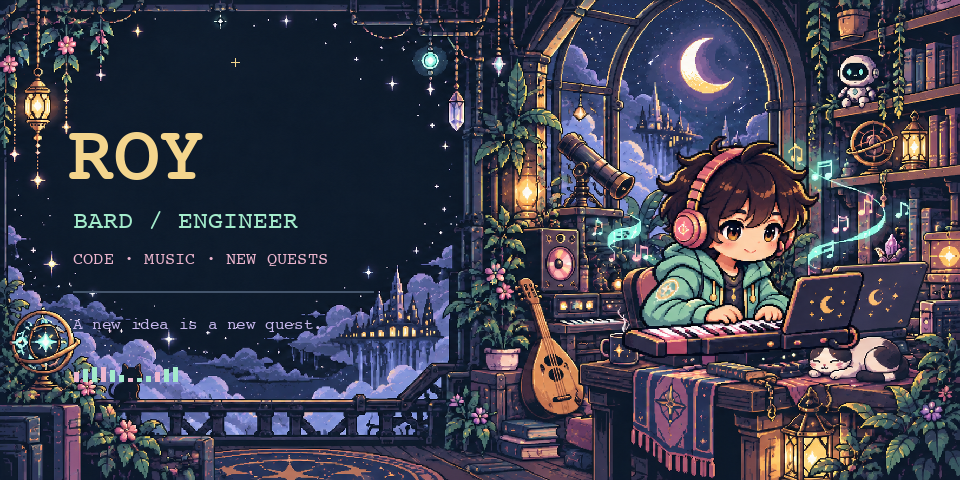
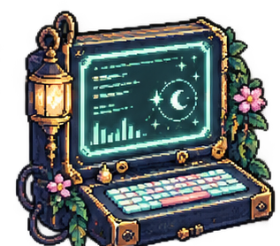
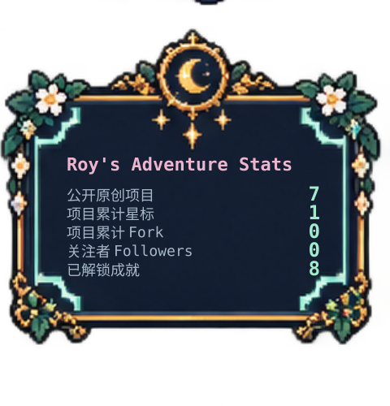
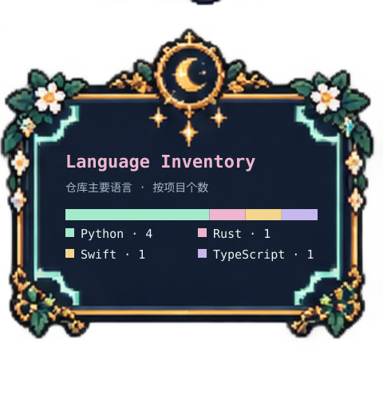
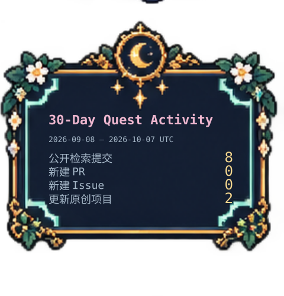

  

  <a href="#character-sheet">角色档案</a> · <a href="#equipment">装备栏</a> · <a href="#quest-log">任务日志</a> · <a href="#achievements">成就殿堂</a>

# Welcome to Roy's world.

把好奇心写成代码，也写成旋律。这个世界的职业设定是 **吟游诗人 × 工程师**，冒险路线经过音乐、编程与二次元。

静态封面 · 查看无动画版本

## Character sheet

- **玩家名** — Roy / `hamletroyophelia`
- **灵感来源** — 二次元、DDLC，尤其是 Monika；喜欢作品里细小、真诚的表达。
- **冒险方式** — 用代码解决日常问题，让声音与画面一起动起来。
- **随身信条** — A new idea is a new quest.

## Equipment

  
  
  
  

<!-- PROFILE-SYNC:techstack:START -->
### Code equipment · 代码装备

  
  
  
  
  
  
  
  
  
  

**主要语言** — Python（4 个仓库） · Rust（1 个仓库） · Swift（1 个仓库） · TypeScript（1 个仓库）

**公开依赖** — Electron · Matplotlib · NumPy · React · SciPy · Vite

<b>Equipment notes · 数据来源</b>

语言取 GitHub 公开仓库的主要语言字段；依赖取最近更新与精选项目的根目录清单（最多 8 个仓库）。不表示熟练度，也不穷尽项目全部技术。

- [midi-dance-avatar / package.json](https://github.com/hamletroyophelia/midi-dance-avatar/blob/HEAD/package.json) — Electron · React · Vite
- [openfoam-cfd-agents / pyproject.toml](https://github.com/hamletroyophelia/openfoam-cfd-agents/blob/HEAD/pyproject.toml) — Matplotlib · NumPy · SciPy

<!-- PROFILE-SYNC:techstack:END -->

### Music equipment · 音乐装备

  
  

`音乐系` Synthesizer V · REAPER · MIDI

## Quest log

<!-- PROFILE-SYNC:projects:START -->

  
  

**公开原创项目 7 个** · **累计星标 1** · **仓库主要语言 4 种**

公开仓库共 **9** 个（含 fork、归档，排除主页）；本范围项目累计 Fork **0**。关注者 **0**，关注中 **1**。

统计窗口：**2026-09-09 至 2026-10-08（30 个 UTC 日期）**。提交数取本人署名、公开仓库默认分支的 GitHub 搜索索引；PR/Issue 是本人在公开仓库新建的数量。排除主页仓库，含其他公开仓库中的贡献，不含私有活动或未索引提交。

<b>Stats journal · 覆盖范围与来源</b>

- 更新的原创项目：2；依据纳入范围项目的最近 push 时间。

- 公开署名提交：8；[公开查询](https://api.github.com/search/commits?q=author%3Ahamletroyophelia%20is%3Apublic%20author-date%3A2026-09-09..2026-10-08%20-repo%3Ahamletroyophelia%2Fhamletroyophelia&per_page=1)。
- 新建 PR：0；[公开查询](https://api.github.com/search/issues?q=author%3Ahamletroyophelia%20is%3Apr%20is%3Apublic%20created%3A2026-09-09..2026-10-08%20-repo%3Ahamletroyophelia%2Fhamletroyophelia&per_page=1)。
- 新建 Issue：0；[公开查询](https://api.github.com/search/issues?q=author%3Ahamletroyophelia%20is%3Aissue%20is%3Apublic%20created%3A2026-09-09..2026-10-08%20-repo%3Ahamletroyophelia%2Fhamletroyophelia&per_page=1)。

搜索索引可能滞后；不将其视为完整的 GitHub 贡献图统计。未知不等于 0。

### Recent quests · 最近更新

**[safari-live-subtitles](https://github.com/hamletroyophelia/safari-live-subtitles)** · Swift · ★ 0 · 2026-10-06
LiveLingo · Native macOS live bilingual subtitles for Safari audio. On-device Japanese/English speech recognition and Chinese translation.

**[music-production-agent](https://github.com/hamletroyophelia/music-production-agent)** · Python · ★ 0 · 2026-09-26
A portable music-production agent workflow for Synthesizer V and REAPER, with targeted diagnostics and scaling-aware automation.

**[openfoam-cfd-agents](https://github.com/hamletroyophelia/openfoam-cfd-agents)** · Python · ★ 0 · 2026-09-06
Auditable multi-agent workflow foundations for Foundation OpenFOAM v14 CFD simulations

**[midi-dance-avatar](https://github.com/hamletroyophelia/midi-dance-avatar)** · TypeScript · ★ 0 · 2026-08-17
Local Windows editor for MIDI-driven Live2D dance, lip-sync, stage visualization, and video export.

**[pot-app-collection-plugin-anki](https://github.com/hamletroyophelia/pot-app-collection-plugin-anki)** · Rust · ★ 0 · 2024-04-07
公开项目；介绍待补充。

<b>Main quest stories · 作品介绍</b>

### ♫ Q01 · 让 MIDI 走上舞台

**[MIDI Dance Avatar](https://github.com/hamletroyophelia/midi-dance-avatar)** — 面向 Windows 的本地编辑器，将音符与歌词转成 Live2D 角色的舞蹈、口型和舞台可视化，支持视频导出。

`TypeScript` · `React` · `Electron` · `MIDI / Live2D`

### ♪ Q02 · 连接声音的魔法

**[Music Production Agent](https://github.com/hamletroyophelia/music-production-agent)** — 面向 Synthesizer V Studio 2 Pro 与 REAPER 的工作流和本地工具集成模板，覆盖歌词旋律对齐、声库调参、编曲混音与导出。

`Synthesizer V` · `REAPER` · `Agent workflows`

### あ Q03 · 听懂屏幕另一端

**[LiveLingo](https://github.com/hamletroyophelia/safari-live-subtitles)** — 原生 macOS 双语字幕工具，为 Safari 网页音频生成日语／英语原文与中文字幕，使用本机 Apple 语音识别和翻译模型。

`Swift` · `macOS` · `Speech & Translation`

<!-- PROFILE-SYNC:projects:END -->

## Achievements

<!-- PROFILE-SYNC:achievements:START -->
由本次公开项目快照和明确规则计算；点击作品成就进入仓库。

  
  
  
  
  
  
  
  

<b>Achievement journal · 规则与解锁记录</b>

- **初次起航** · 已解锁 — 本次公开数据中存在[对应原创仓库](https://github.com/hamletroyophelia/Alien_Invasion)。
- **舞台搭建师** · 已解锁 — 本次公开数据中存在[对应原创仓库](https://github.com/hamletroyophelia/midi-dance-avatar)。
- **声音炼金术** · 已解锁 — 本次公开数据中存在[对应原创仓库](https://github.com/hamletroyophelia/music-production-agent)。
- **跨语之桥** · 已解锁 — 本次公开数据中存在[对应原创仓库](https://github.com/hamletroyophelia/safari-live-subtitles)。
- **流场观察者** · 已解锁 — 本次公开数据中存在[对应原创仓库](https://github.com/hamletroyophelia/openfoam-cfd-agents)。
- **地图拓荒者** · 已解锁 — 公开原创项目达到 5 个；当前值 7，门槛 5。
- **初次回响** · 已解锁 — 公开原创项目获得至少 1 星；当前值 1，门槛 1。
- **多语符文** · 已解锁 — 仓库主要语言达到 3 种；当前值 4，门槛 3。
- **世界扩张** · 待解锁 — 公开原创项目达到 10 个；当前值 7，门槛 10。
- **十重回响** · 待解锁 — 公开原创项目累计 10 星；当前值 1，门槛 10。

成就是自定义作品里程碑；项目存在、星标和语言规则可自动核验，不代表 GitHub 官方成就或项目质量评定。
<!-- PROFILE-SYNC:achievements:END -->

---

  <a href="https://github.com/hamletroyophelia?tab=repositories">Open the project map</a> · <a href="https://github.com/hamletroyophelia?tab=stars">Explore my treasure chest</a>
   
  A little code. A little music. The adventure continues.

